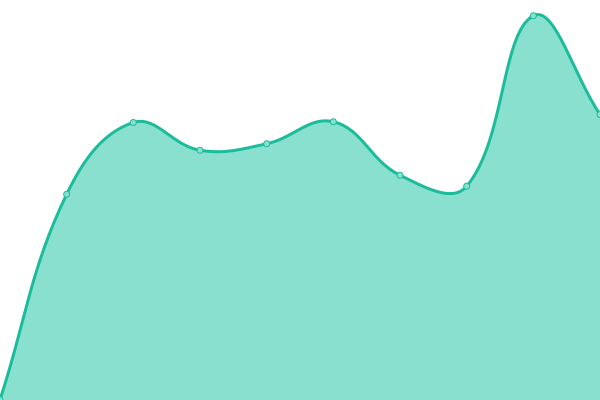

# [📈 Live Status](https://Frostist.github.io/britalianuptime): <!--live status--> **🟩 All systems operational**

This repository contains the open-source uptime monitor and status page for [Will Frost](WillFrost.co.za), powered by [Upptime](https://github.com/upptime/upptime).

With [Upptime](https://upptime.js.org), you can get your own unlimited and free uptime monitor and status page, powered entirely by a GitHub repository. We use [Issues](https://github.com/Frostist/britalianuptime/issues) as incident reports, [Actions](https://github.com/Frostist/britalianuptime/actions) as uptime monitors, and [Pages](https://Frostist.github.io/britalianuptime) for the status page.

<!--start: status pages-->
<!-- This summary is generated by Upptime (https://github.com/upptime/upptime) -->
<!-- Do not edit this manually, your changes will be overwritten -->
<!-- prettier-ignore -->
| URL | Status | History | Response Time | Uptime |
| --- | ------ | ------- | ------------- | ------ |
|  [Perffin Wordpress Site](https://www.perffingroup.com) | 🟩 Up | [perffin-wordpress-site.yml](https://github.com/Frostist/britalianuptime/commits/HEAD/history/perffin-wordpress-site.yml) | 

 1045ms
     
 | 

<a href="https://Frostist.github.io/britalianuptime/history/perffin-wordpress-site">100.00%</a>
    

|  [Perffin Framer Site](https://perffingroup.framer.website) | 🟩 Up | [perffin-framer-site.yml](https://github.com/Frostist/britalianuptime/commits/HEAD/history/perffin-framer-site.yml) | 

 175ms
     
 | 

<a href="https://Frostist.github.io/britalianuptime/history/perffin-framer-site">54.85%</a>
    

|  [Britalian Site](https://britalian.co.za) | 🟩 Up | [britalian-site.yml](https://github.com/Frostist/britalianuptime/commits/HEAD/history/britalian-site.yml) | 

 1327ms
     
 | 

<a href="https://Frostist.github.io/britalianuptime/history/britalian-site">97.05%</a>
    

|  [Qrescendo Site](https://qrescendo.co) | 🟩 Up | [qrescendo-site.yml](https://github.com/Frostist/britalianuptime/commits/HEAD/history/qrescendo-site.yml) | 

 817ms
     
 | 

<a href="https://Frostist.github.io/britalianuptime/history/qrescendo-site">100.00%</a>
    

|  [Secret Network](https://scrt.network) | 🟩 Up | [secret-network.yml](https://github.com/Frostist/britalianuptime/commits/HEAD/history/secret-network.yml) | 

 1497ms
     
 | 

<a href="https://Frostist.github.io/britalianuptime/history/secret-network">100.00%</a>
    

|  [Will Frost Site](https://willfrost.co.za) | 🟩 Up | [will-frost-site.yml](https://github.com/Frostist/britalianuptime/commits/HEAD/history/will-frost-site.yml) | 

 448ms
     
 | 

<a href="https://Frostist.github.io/britalianuptime/history/will-frost-site">100.00%</a>
    

|  [Portfoliage](https://portfoliage.co) | 🟩 Up | [portfoliage.yml](https://github.com/Frostist/britalianuptime/commits/HEAD/history/portfoliage.yml) | 

 1981ms
     
 | 

<a href="https://Frostist.github.io/britalianuptime/history/portfoliage">100.00%</a>
    

<!--end: status pages-->

[**Visit our status website →**](https://Frostist.github.io/britalianuptime)

## 📄 License

- Powered by: [Upptime](https://github.com/upptime/upptime)
- Code: [MIT](./LICENSE) © [Anand Chowdhary](https://anandchowdhary.com), supported by [Pabio](https://pabio.com)
- Data in the `./history` directory: [Open Database License](https://opendatacommons.org/licenses/odbl/1-0/)
