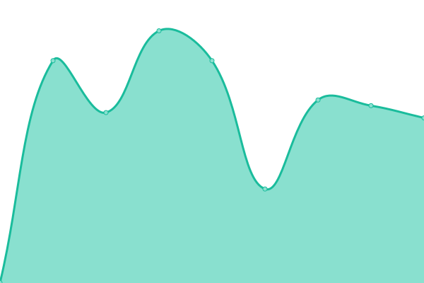
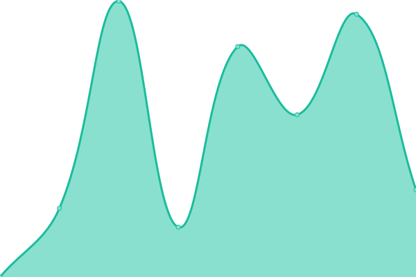
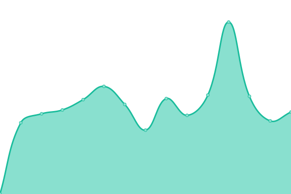
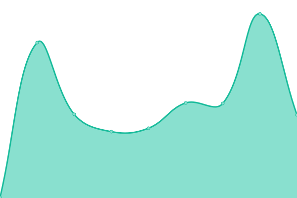

# [📈 Live Status](https://Frostist.github.io/britalianuptime): <!--live status--> **🟧 Partial outage**

Retrofitted for Britalian's websites to monitor uptime.

<!--start: status pages-->
<!-- This summary is generated by Upptime (https://github.com/upptime/upptime) -->
<!-- Do not edit this manually, your changes will be overwritten -->
<!-- prettier-ignore -->
| URL | Status | History | Response Time | Uptime |
| --- | ------ | ------- | ------------- | ------ |
|  [Perffin Framer Site](https://www.perffingroup.com) | 🟩 Up | [perffin-framer-site.yml](https://github.com/Frostist/BritalianWebsiteWatcher/commits/HEAD/history/perffin-framer-site.yml) | 

 614ms
     
 | 

<a href="https://Frostist.github.io/britalianuptime/history/perffin-framer-site">100.00%</a>
    

|  [Britalian Site](https://britalian.co.za) | 🟩 Up | [britalian-site.yml](https://github.com/Frostist/BritalianWebsiteWatcher/commits/HEAD/history/britalian-site.yml) | 

 453ms
     
 | 

<a href="https://Frostist.github.io/britalianuptime/history/britalian-site">100.00%</a>
    

|  [Qrescendo Site](https://qrescendo.co) | 🟩 Up | [qrescendo-site.yml](https://github.com/Frostist/BritalianWebsiteWatcher/commits/HEAD/history/qrescendo-site.yml) | 

 1455ms
     
 | 

<a href="https://Frostist.github.io/britalianuptime/history/qrescendo-site">100.00%</a>
    

|  [Secret Network](https://scrt.network) | 🟩 Up | [secret-network.yml](https://github.com/Frostist/BritalianWebsiteWatcher/commits/HEAD/history/secret-network.yml) | 

 170ms
     
 | 

<a href="https://Frostist.github.io/britalianuptime/history/secret-network">100.00%</a>
    

|  [Will Frost Site](https://willfrost.co.za) | 🟩 Up | [will-frost-site.yml](https://github.com/Frostist/BritalianWebsiteWatcher/commits/HEAD/history/will-frost-site.yml) | 

 545ms
     
 | 

<a href="https://Frostist.github.io/britalianuptime/history/will-frost-site">100.00%</a>
    

|  [Portfoliage](https://portfoliage.co) | 🟥 Down | [portfoliage.yml](https://github.com/Frostist/BritalianWebsiteWatcher/commits/HEAD/history/portfoliage.yml) | 

 1965ms
     
 | 

<a href="https://Frostist.github.io/britalianuptime/history/portfoliage">12.83%</a>
    

|  [Learning2Learn](https://learning2learn.africa) | 🟩 Up | [learning2-learn.yml](https://github.com/Frostist/BritalianWebsiteWatcher/commits/HEAD/history/learning2-learn.yml) | 

 1471ms
     
 | 

<a href="https://Frostist.github.io/britalianuptime/history/learning2-learn">99.73%</a>
    

|  [Lisa Loud](https://lisaloud.com) | 🟩 Up | [lisa-loud.yml](https://github.com/Frostist/BritalianWebsiteWatcher/commits/HEAD/history/lisa-loud.yml) | 

 214ms
     
 | 

<a href="https://Frostist.github.io/britalianuptime/history/lisa-loud">100.00%</a>
    

<!--end: status pages-->
